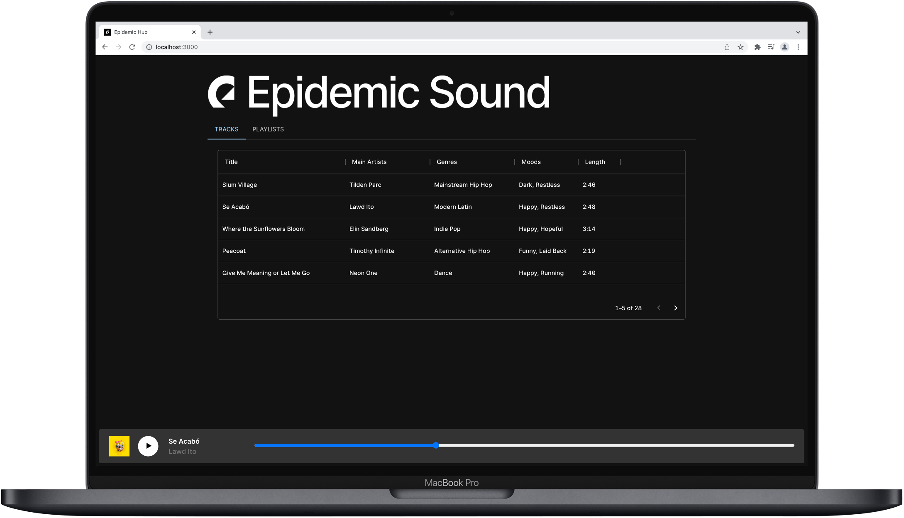

# Epidemic Hub

This project contains a simple backend and frontend for the Epidemic Sound [take-home assignment](https://github.com/epidemicsound/take-home-assignment). Backend is written in Python/Django and frontend is implemented using React/TypeScript.

<p>
  
</p>

## Getting Started

Before getting started, make sure to have [Docker](https://docs.docker.com/engine/install/) and [docker-compose](https://docs.docker.com/compose/install/) installed. Then run:

```bash
docker-compose up
```

Now you can reach the frontend at `http://localhost:3000`. You can also browse the REST API at `http://localhost:8000`.

## Development and Testing

For development you'll need a Python version `3.9.10` virtualenv and [Poetry](https://python-poetry.org/docs/) installed.You could also use the virtualenv provided by Poetry. First, change directory to `api` and bring up the dev dependencies using Docker:

```bash
docker-compose -f docker-compose.dev.yml up -d
```

Then you can install required packages and start the project:

```bash
(venv) poetry install
(venv) poetry run python manage.py migrate
(venv) poetry run python manage.py runserver
```

Now you're able to access the API server at `http://localhost:8000`.

You can also run tests using `pytest`:

```bash
(venv) pytest -v --cov
```

With the result being similar to:

```bash
========================================================================= test session starts =========================================================================
platform darwin -- Python 3.9.10, pytest-6.2.5, py-1.11.0, pluggy-1.0.0 -- ~/venv/bin/python3.9.10
cachedir: .pytest_cache
django: settings: epidemic.settings (from ini)
rootdir: /Users/moeen/Developer/Web/epidemic-hub/api, configfile: pytest.ini
plugins: django-4.5.2, cov-3.0.0
collected 8 items                                                                                                                                                     

....
tracks/tests/test_views.py::PlaylistTestCase::test_create_playlist_invalid_title PASSED                                                                         [ 62%]
tracks/tests/test_views.py::PlaylistTestCase::test_modify_invalid_playlist PASSED                                                                               [ 75%]
tracks/tests/test_views.py::PlaylistTestCase::test_modify_playlist_invalid_data PASSED                                                                          [ 87%]
tracks/tests/test_views.py::PlaylistTestCase::test_modify_playlist_tracks PASSED                                                                                [100%]

---------- coverage: platform darwin, python 3.9.10-final-0 ----------
Name                                   Stmts   Miss  Cover
----------------------------------------------------------
....
tracks/models.py                          51      9    82%
tracks/serializers.py                     28      2    93%
tracks/tests/test_models.py               29      0   100%
tracks/tests/test_views.py                35      0   100%
tracks/urls.py                             8      0   100%
tracks/views.py                           73     21    71%
----------------------------------------------------------
TOTAL                                    295     32    89%


========================================================================== 8 passed in 6.97s ==========================================================================

```

For frontend development, head over to the `frontend` directory and:

```bash
yarn install
yarn start
```

Now you're able to access the client at `http://localhost:3000`.

## License

MIT License

Copyright (c) 2022 Moeen Zamani

Permission is hereby granted, free of charge, to any person obtaining a copy
of this software and associated documentation files (the "Software"), to deal
in the Software without restriction, including without limitation the rights
to use, copy, modify, merge, publish, distribute, sublicense, and/or sell
copies of the Software, and to permit persons to whom the Software is
furnished to do so, subject to the following conditions:

The above copyright notice and this permission notice shall be included in all
copies or substantial portions of the Software.

THE SOFTWARE IS PROVIDED "AS IS", WITHOUT WARRANTY OF ANY KIND, EXPRESS OR
IMPLIED, INCLUDING BUT NOT LIMITED TO THE WARRANTIES OF MERCHANTABILITY,
FITNESS FOR A PARTICULAR PURPOSE AND NONINFRINGEMENT. IN NO EVENT SHALL THE
AUTHORS OR COPYRIGHT HOLDERS BE LIABLE FOR ANY CLAIM, DAMAGES OR OTHER
LIABILITY, WHETHER IN AN ACTION OF CONTRACT, TORT OR OTHERWISE, ARISING FROM,
OUT OF OR IN CONNECTION WITH THE SOFTWARE OR THE USE OR OTHER DEALINGS IN THE
SOFTWARE.
